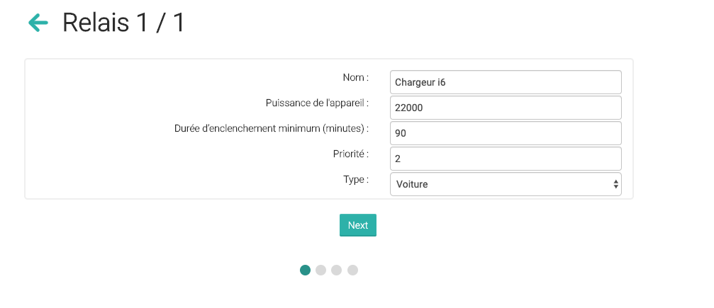

# **Climkit**
## __Manuel de l’installateur__ 

service@climkit.io  
+41 21 533 00 86

v. 2019.9

<table bordercolor="#ff0000" style="font-family:"WeblySleek UI"" >
	<thead>
		<tr>
			<th bgcolor="#FF0000" style="color:#ffffff;font-weight:bold">AVERTISSEMENT</th>
		</tr>
	</thead>
	<tbody>
		<tr>
			<td bgcolor="#ffffff"  >
				Seul un personnel qualifié doit effectuer l’installation, l’utilisation, l’entretien et la maintenance du matériel électrique. Climkit n’assume aucune responsabilité des conséquences éventuelles découlant de l’utilisation de cette documentation ou des équipements fournis.
			</td>
		</tr>
		<tr>
			<td bgcolor="#ffffff"  > 
				Par personne qualifiée, on entend un technicien compétent en matière de construction, d’installation et d’utilisation des équipements électriques et formé aux procédures de sécurité, donc capable de détecter et d’éviter les risques associés.
			</td>
		</tr>
	</tbody>
</table>

# **1. Planification**

## 1.1. __Mode de raccordement__
Selon le type d’installation, choisir parmi les 3 modes de raccordements ci-dessous. Les schémas complets sont en annexes de ce manuel et à télécharger en DWG 
<a href="https://drive.google.com/open?id=1kSpSGk46yjnMfjci7kkgufYqV5Ixd_5z" target="_blank">sur ce lien</a>.

### 1.1.1. Community
Installation en regroupement RCP avec 1 seul point d’introduction au réseau et plusieurs consommateurs (appartements, bureaux, communs, etc.).

### 1.1.2. Single
Installation avec 1 seul point d’introduction au réseau et 1 seul consommateur (ex. une villa individuelle ou une entreprise).

### 1.1.3. Microgrid
Installation avec 1 seul point d’introduction, plusieurs consommateurs et plusieurs bâtiments. Prévoir un gateway et une connexion internet (LAN ou router 4G) par bâtiment.

## __1.2. Équipements__
Une fois le mode de raccordement choisi, prévoir le nombre et type d’équipements :

### 1.2.1. Compteur direct (≤80A)

Compteurs directs pour les connexions inférieures à 80A.

### 1.2.2. Compteur indirect (>80A)
Compteurs indirects avec TI pour des connexions supérieures à 80A. Préciser l’ampérage exact lors de la commande.

### 1.2.3. Transformateur d’intensité (TI) pour compteurs indirects

Déterminer le type de TI selon l’intensité de la connexion (ampérage).

    

Les TI se clipsent directement sur le câble ou la barre en cuivre de chaque phase. Attention à la section du câble par rapport au diamètre du TI.

D’autres TI peuvent être commandés pour les cas spécifiques avec un diamètre plus grand. A préciser lors de la commande.

&nbsp;

### 1.2.4. Gateway
Le gateway Climkit est fourni avec son alimentation AC/DC 5V sur rail DIN, le câble d’alimentation micro- usb et l’adaptateur RS485-USB

 *Gateway, alimentation 5V, câble micro-usb et adaptateur RS485-USB.* 

### 1.2.5. Routeur

Le routeur 4G Climkit est fourni avec son alimentation AC/DC 12V et une carte SIM Swisscom activée. 

Aucun partage de connexion n’est possible avec les cartes Swisscom sans avis préalable. Si des trop grandes consommations sont constatées, les cartes sont désactivées automatiquement. 

Si volonté d’y connecter d’autres appareils (PAC, onduleurs etc.), demandez une extension de l'abonnement Swisscom lors de la commande (par exemple 300MB à CHF 8.-/mois).

Lorsque le signal GSM est trop faible ou absent, commander une rallonge d’antenne (3, 5, 10, 15 ou 20m) ou déporter le router vers une zone avec signal.

### 1.2.6. Plaque compteur en T et boîtier rail DIN
Pour les tableaux avec des plaques compteurs GRD, il est possible de commander des boîtiers rail DIN avec plaque de fixation.

 *Boîtier rail DIN sur plaque de fixation T (H : 36cm, L :21cm)* 

### 1.2.7. Kit Optimisation

	 

Le kit Optimisation permet de piloter 8 appareils.
&nbsp;

&nbsp;

Le kit Optimisation Single permet un raccordement rapide sur une villa par exemple avec un compteur d’introduction et un compteur de production inclus au tableau.

Il s’agit de compteurs indirects livrés avec des TI de 10, 20 ou 50A selon l’introduction et la puissance photovoltaïque.

Les appareils de force comme le chauffe-eau, la borne électrique ou la pompe de la piscine doivent se commander via un contacteur de puissance. La PAC peut être pilotée via son contact libre de potentiel, souvent appelé « Smartgrid ready».

&nbsp;

&nbsp;

  

	 

Le kit Optimisation Community comprend les mêmes éléments que le kit Optimisation Single à l’exception des compteurs d’introduction et production. 

Le Gateway est inclus dans le kit. Les bornes noir, orange et jaune en haut à gauche permettent d’y raccorder le bus des compteurs.

&nbsp;

*Voir Schéma de principe [Optimisation Single](https://drive.google.com/open?id=11QG82L_p-Vm8XuC-CEz3CTR0U9sn2-z2) et [Optimisation Community](https://drive.google.com/open?id=1DKmTyYtQhnNrU9XTOwKUOJlrh_D8yMNT)*

&nbsp;

&nbsp;

&nbsp;

&nbsp;

&nbsp;

### 1.2.8. Exemple de tableau d’introduction

Dans le cadre de la mise en place d’un RCP sur un immeuble existant, il est recommandé de construire un tableau d’introduction dans lequel le GRD installera son compteur général.

On peut aussi en profiter pour y raccorder le photovoltaïque et y installer les équipements Climkit.

&nbsp;

<table bordercolor="#ff0000" style="font-family:"WeblySleek UI"" >
	<thead>
		<tr>
			<th bgcolor="#FF0000" style="color:#ffffff;font-weight:bold">CHECK-LIST À RELEVER SUR PLACE</th>
		</tr>
	</thead>
	<tbody>
		<tr>
			<td bgcolor="#ffffff"  >
					  Nombre et type de compteurs (direct ou indirect si >80A) + intensité si compteur indirect.
			</td>
		</tr>
		<tr>
			<td bgcolor="#ffffff"  >
					  Nombre de plaque compteur pour fixation sur plaque en T.
			</td>
		</tr>
		<tr>
			<td bgcolor="#ffffff"  >
					  Nombre et puissance des points d’introduction au réseau électrique. Un regroupement RCP par introduction.
			</td>
		</tr>
		<tr>
			<td bgcolor="#ffffff"  >
					  Puissance de l’installation photovoltaïque en kWp.
			</td>
		</tr>
		<tr>
			<td bgcolor="#ffffff"  >
					  Si aucune connexion LAN n’est disponible, vérifier la bonne réception mobile 4G LTE Swisscom.
			</td>
		</tr>
		<tr>
			<td bgcolor="#ffffff"  >
					  Prévoir le cas échéant une antenne ou déporter le router.
			</td>
		</tr>
	</tbody>
</table>

&nbsp;

# 2. Enregistrement et commande

1) Demander un compte installateur via service@climkit.io.

2) Se connecter à votre compte sur www.app.climkit.io    
et ajouter une installation en cliquant sur « + ».

3) Remplir le formulaire.  
Attention à choisir le mode de raccordement souhaité sous « Type d’installation » :

* Single  
* Community  

Contacter Climkit pour la mise en place d’un raccordement en mode microgrid.  
Cocher « Kit Optimisation » si vous désirez le produit.  
Cliquer « Enregistrer ».

4) Cliquer sur « Compteurs » dans le menu de gauche et ajouter le nombre de compteurs souhaités avec le bouton « + »

5) Une fois que tous les compteurs ont été ajoutés, passer commande en cliquant sur « Commander le matériel ».  
Compléter le formulaire et cliquer « Envoyer »

6) Vous recevrez ensuite une demande de confirmation de commande par e-mail d’ici 48h.

7) Le matériel est ensuite livré dans les 15 jours.

<table bordercolor="#ff0000" style="font-family:"WeblySleek UI"" >
	<thead>
		<tr>
			<th bgcolor="#FF0000" style="color:#ffffff;font-weight:bold">À PRECISER LORS DE LA COMMANDE</th>
		</tr>
	</thead>
	<tbody>
		<tr>
			<td bgcolor="#ffffff"  >
					  Ampérage exact pour les compteurs indirects.
			</td>
		</tr>
		<tr>
			<td bgcolor="#ffffff"  >
					  TI avec diamètre spécial.
			</td>
		</tr>
		<tr>
			<td bgcolor="#ffffff"  >
					  Adresse de livraison.
			</td>
		</tr>
		<tr>
			<td bgcolor="#ffffff"  >
					  Référence personnelle si besoin (numéro de projet, etc.)
			</td>
		</tr>
		<tr>
			<td bgcolor="#ffffff"  >
					  Nombre de compteurs de production si plus que 1.
			</td>
		</tr>
	</tbody>
</table>

&nbsp;

# 3. Installation et branchement

## 3.1. Compteur direct (≤80A)

&nbsp;

<table bordercolor="#ff0000" style="font-family:"WeblySleek UI"" >
	<thead>
		<tr>
			<th bgcolor="#FF0000" style="color:#ffffff;font-weight:bold">IMPORTANT POUR LE BRANCHEMENT</th>
		</tr>
	</thead>
	<tbody>
		<tr>
			<td bgcolor="#ffffff"  >
					  Branchement par le haut.
			</td>
		</tr>
		<tr>
			<td bgcolor="#ffffff"  >
					  Un neutre d’excitation suffit mais il peut être traversant.
			</td>
		</tr>
		<tr>
			<td bgcolor="#ffffff"  >
					  Bornes courant fort du haut étant proche des bornes du bus courant faible, mettre de la toile isolante sur les bornes courant fort par sécurité.
			</td>
		</tr>
		<tr>
			<td bgcolor="#ffffff"  >
					  Bornes du bus: serrage léger
			</td>
		</tr>
		<tr>
			<td bgcolor="#ffffff"  >
					  Câble du bus de type U72 1x4x0.8mm blindé.
			</td>
		</tr>
		<tr>
			<td bgcolor="#ffffff"  >
					  Compteur photovoltaïque : l’installation PV doit être vue comme un consommateur, donc côté réseau en haut et côté PV en bas.
			</td>
		</tr>
	</tbody>
</table>

## 3.2. Compteur indirect (>80A)

## 3.3. Transformateur d’intensité (TI)
Connecter un TI sur la phase L1 :  

&nbsp;&nbsp;&nbsp;&nbsp;&nbsp;&nbsp;	1.	Connecter les fils S1 (blanc) et S2 (noir) du TI sur le compteur :  

&nbsp;&nbsp;&nbsp;&nbsp;&nbsp;&nbsp;	2.	Clipser le TI sur le câble de L1 avec la flèche dans le sens du bâtiment :

&nbsp;&nbsp;&nbsp;&nbsp;&nbsp;&nbsp;	3.	Vérifier le « Cosphi / Power Factor (PF) » :  

&nbsp;&nbsp;&nbsp;&nbsp;&nbsp;&nbsp;		- Enclencher le compteur  
&nbsp;&nbsp;&nbsp;&nbsp;&nbsp;&nbsp;		- Avec le bouton  , contrôler que le cophi soit proche de 1 sur chaque phase.

&nbsp;&nbsp;&nbsp;&nbsp;&nbsp;&nbsp;	4.	Contrôler la polarité avec la puissance instantanée de L1 :  

&nbsp;&nbsp;&nbsp;&nbsp;&nbsp;&nbsp;		- Enclencher le compteur  
&nbsp;&nbsp;&nbsp;&nbsp;&nbsp;&nbsp;		- Avec le bouton  , contrôler que la puissance instantanée soit positive. Lorsque l’onduleur est enclenché et qu’il y a du refoulement dans le réseau, la puissance doit être négative. 

  
&nbsp;&nbsp;&nbsp;&nbsp;&nbsp;&nbsp;		- Si la puissance est négative, inverser le sens du TI ou croiser les fils S1 et S2.  
&nbsp;&nbsp;&nbsp;&nbsp;&nbsp;&nbsp;		- Pour les compteurs de production, la puissance instantanée doit être négative.  

&nbsp;&nbsp;&nbsp;&nbsp;&nbsp;&nbsp;	5.	Répéter la démarche pour la phase L2 et L3.  

## 3.4.	Gateway et routeur
<table bordercolor="#ff0000" style="font-family:"WeblySleek UI"" >
	<thead>
		<tr>
			<th bgcolor="#FF0000" style="color:#ffffff;font-weight:bold">IMPORTANT</th>
		</tr>
	</thead>
	<tbody>
		<tr>
			<td>
					  Alimentation 5V pour le gateway.
			</td>
		</tr>
		<tr>
			<td>
					  Possibilité d’utiliser une connexion LAN ethernet ou Wifi.
			</td>
		</tr>
		<tr>
			<td>
					  Alimentation 12V pour le routeur.
			</td>
		</tr>
		<tr>
			<td>
					  Connecter les 4 antennes du routeur (2x 4G + 2x 2.4G).
			</td>
		</tr>
		<tr>
			<td>
					  Rallonge d’antenne : brancher sur 4G côté carte SIM. Essayer du côté opposé si aucune connexion.
			</td>
		</tr>
		<tr>
			<td>
					  Connexion 4G uniquement pour le gateway Climkit. Ne pas y connecter d’autres appareils.
			</td>
		</tr>
		<tr>
			<td>
					  Branchement du câble RJ45 dans une prise LAN jaune.
			</td>
		</tr>
	</tbody>
</table>

## 3.5.	Raccordement du bus  
Le raccordement des compteurs au réseau bus nécessite un travail soigné et rigoureux. Pour les nouveaux tableaux, il est recommandé de le faire en atelier.  

<table bordercolor="#ff0000" style="font-family:"WeblySleek UI"" >
	<thead>
		<tr>
			<th bgcolor="#FF0000" style="color:#ffffff;font-weight:bold">IMPORTANT</th>
		</tr>
	</thead>
	<tbody>
		<tr>
			<td>
					  Adaptateur RS485 : Seul les fils Orange=A, Jaune=B et Noir=GND sont utilisés.
			</td>
		</tr>
		<tr>
			<td>
					  Câble du bus de type U72 1x4x0.8mm blindé avec feuille d’aluminium.
			</td>
		</tr>
		<tr>
			<td>
					  Brancher les fils A, B et GND (G) en série sur chaque compteur.
			</td>
		</tr>
		<tr>
			<td>
					  Ne PAS utiliser de résistance de terminaison.
			</td>
		</tr>
		<tr>
			<td>
					  Ne PAS connecter le GND à la terre
			</td>
		</tr>
	</tbody>
</table>

# 4. Configuration et mise en service  
## 4.1. Compteurs électriques, adressage et connexion  
1) Configurer l’adresse de chaque compteur (11, 12, …) selon la liste des compteurs :   
 

Sur le compteur, presser  pendant 3 secondes et entrer le mot de passe par défaut (1000) 
avec les touches  et  . Presser  pendant 3 secondes pour confirmer.    

&nbsp;&nbsp;&nbsp;&nbsp;&nbsp;&nbsp;	a.	Sous « SET Addr », entrer l’adresse du compteur :

* Compteur d’introduction : 10  
* Compteurs des consommateurs : 11, 12, 13, …  
* Compteurs de production : 101, 102, 103, …  

&nbsp;&nbsp;&nbsp;&nbsp;&nbsp;&nbsp;	b.	Changer le mot de passe de chaque compteur sous « SET PASS » avec le mot de passe indiqué sous « Configuration / Installation » :

&nbsp;&nbsp;&nbsp;&nbsp;&nbsp;&nbsp;	c.	Changer le ratio des TI sous « CT rate ».  
Attention, le ratio ne peut être enregistré qu’une seule fois !   
CT rate = courant primaire du TI divisé par son courant secondaire (5A)  
(Ex : Courant primaire du TI 200A, CT rate = 200/5 = 40)  

En général, le ratio des TI est programmé par nos soins sauf pour les commandes avec plusieurs compteurs indirects et si le compteur est commandé sans TI.

2)	Vérifier la connexion Internet avec un ordinateur raccordé au routeur. Ne pas utiliser cette connexion pour télécharger d’autres données. En cas d’excès de volume de données téléchargées, les cartes SIM se désactivent automatiquement.

3)	Redémarrer le gateway, le routeur et attendre 5 minutes.

<table bordercolor="#ff0000" style="font-family:"WeblySleek UI"" >
	<thead>
		<tr>
			<th bgcolor="#FF0000" style="color:#ffffff;font-weight:bold">IMPORTANT</th>
		</tr>
	</thead>
	<tbody>
		<tr>
			<td>
					  Le ratio des TI sur le compteur indirect ne peut se changer qu’une seule fois.
			</td>
		</tr>
		<tr>
			<td>
					  L’adresse doit correspondre à l’emplacement du compteur selon la désignation.
			</td>
		</tr>
	</tbody>
</table>

&nbsp;

## 4.2. Paramétrisation des relais sur la plateforme
Sous l'onglet "Configuration" de votre installation, vous trouverez le menu "Relais" vous permettant de configurer les modes de vos choix sur les appareils désirés lors de l'installation d'un **Kit Optimisation**.
### 4.2.1. Initialiser les premiers relais
Lorsque vous avez cliqué sur "Paramètres des relais", vous pourrez par exemple sélectionner l'adresse "1" afin de configurer vos 8 premiers appareils sur ces relais.  
  
Ensuite, vous verrez apparaître la table des relais "vierges", prêts pour la configuration allant des adresses 1/1 à 1/8.  

Suite à la création des 8 premiers relais sur la plateforme, vous pouvez commencer la configuration en cliquant sur  du relai de votre choix (ici à l'adresse 1/1 nous avons choisi le chargeur véhicule).  
  
Un deuxième exemple, avec l'adresse 1 / 2 (comme 2ème appareil, la pompe de piscine), que nous faisons passer volontairement en priorité 1:    
  
Ainsi, vous devez définir les champs suivants:  

* Choisir le nom du relai/de l'appareil  
* Donner sa puissance en W  
* Déterminer sa durée d'enclenchement minimum (ne se stoppera pas avant d'avoir fini ce cycle)  
* Fixer éventuellement sa priorité, le plus bas sera prioritaire dans ce cas  
* Choisir le type dans la liste proposée  

### 4.2.2. Modes de fonctionnement des relais
La prochaine étape est de définir le mode de fonctionnement du relai choisi parmi nos choix :  
  

* Solaire uniquement ! L'appareil choisi ne consommera de l'électricité que quand la production est suffisante.
* Minimum quotidien en complément du solaire: par exemple la pompe de la piscine s‘enclenche en fonction de la production et complète son minimum requis durant la nuit.
* Automatique et minuterie : Faites fonctionner un appareil durant des heures spécifiques en plus de l'autoconsommation solaire.
* Minuterie uniquement : Programmez votre charge de véhicule ou votre chauffe-eau à l'avance !   

  

* Toujours enclenché / éteint  

&nbsp;

# 5.	Vérification des compteurs  

Contrôler le branchement des compteurs en allant sous l’onglet « Configuration -> contrôle des compteurs ».

## 5.1.	Compteurs communauté  

  

1.	Tous compteurs doivent être en « True ».
2.	Toutes les phases doivent avoir une tension entre 230V et 240V « L1V, L2V, L3V ».
3.	Les compteurs consommateurs doivent avoir une puissance positive sur chaque phase « L1W, L2W, L3W ».
4.	Pour les compteurs consommateurs (11, 12, 13, …), il ne doit y avoir aucune énergie exportée sous « Exp ».
5.	Vérifier le mot de passe de chaque compteur s’il correspond à la configuration.
6.	Sans installation de production d’énergie, les puissances instantanées sur le compteur 10 doivent être positives. En cas de refoulement, les puissances sont négatives. Vérifier le branchement en coupant les onduleurs.

## 5.2.	Compteurs production

  

1.	Le compteur de production doit avoir des puissances négatives « L1W, L2W, L3W »

# 6.	Finalisation  

1.	Contacter Climkit pour notifier la mise en service et contrôler le bon fonctionnement de la connexion et de la lecture des compteurs.

2.	Transmettre à l’adresse service@climkit.io les coordonnées du propriétaire :  

| Société |    &nbsp;&nbsp;&nbsp;&nbsp;&nbsp;&nbsp;&nbsp;&nbsp;&nbsp;&nbsp;&nbsp;&nbsp;&nbsp;&nbsp;&nbsp;&nbsp;&nbsp;&nbsp;&nbsp;&nbsp;&nbsp;&nbsp;&nbsp;&nbsp;&nbsp;&nbsp;&nbsp;&nbsp;&nbsp;&nbsp;&nbsp;&nbsp;&nbsp;&nbsp;&nbsp;&nbsp;&nbsp;&nbsp;&nbsp;&nbsp;&nbsp;&nbsp;&nbsp;&nbsp;&nbsp;&nbsp;&nbsp;&nbsp;&nbsp;&nbsp;&nbsp;&nbsp;&nbsp;&nbsp;&nbsp;&nbsp;&nbsp;&nbsp;&nbsp;&nbsp;&nbsp;&nbsp;&nbsp;&nbsp;&nbsp;&nbsp;&nbsp;&nbsp;&nbsp;&nbsp;&nbsp;&nbsp;&nbsp;&nbsp;&nbsp;&nbsp;&nbsp;&nbsp;&nbsp;&nbsp;&nbsp;&nbsp;&nbsp;&nbsp;&nbsp;&nbsp;&nbsp;&nbsp;&nbsp;&nbsp;&nbsp;&nbsp;&nbsp;&nbsp;&nbsp;&nbsp;                                                |
|-----------------------|----------------------------------------------------|
| Nom et prénom |  |
| Adresse |  |
| E-mail |  |
| Téléphone |  |
| Nom de l’installation |  |

# 7. Annexes

Ce manuel ainsi que les schémas de principe peuvent évoluer. 
Merci de vérifier que vous utilisez et/ou ayez téléchargé la dernière version.

Climkit SA  
Rue Jean-Jacques Rousseau 5, CH- 1800 Vevey  
service@climkit.io  
021 533 00 86  
www.climkit.io  
© Climkit SA 2019  

